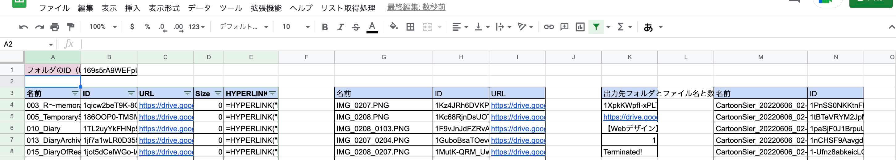
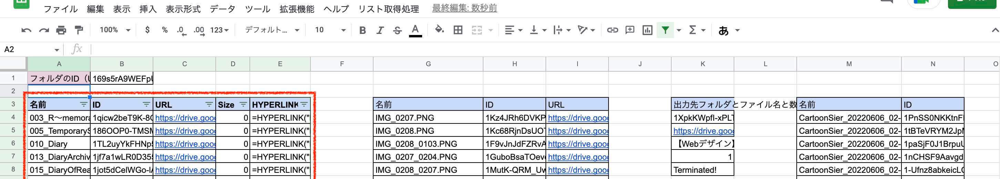
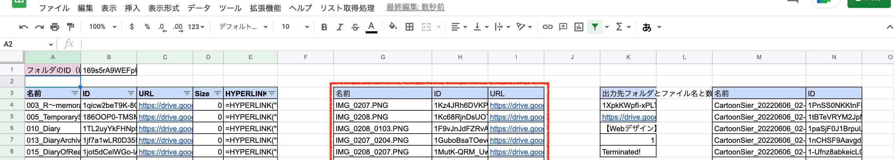
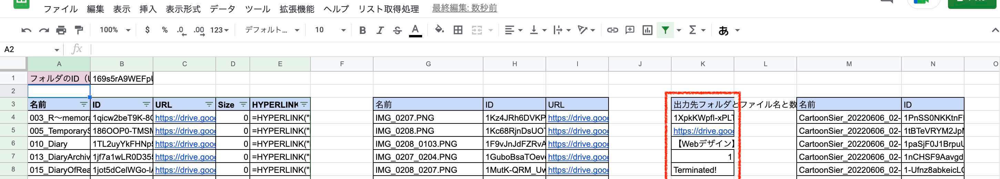
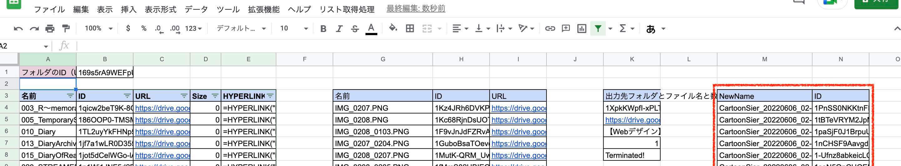
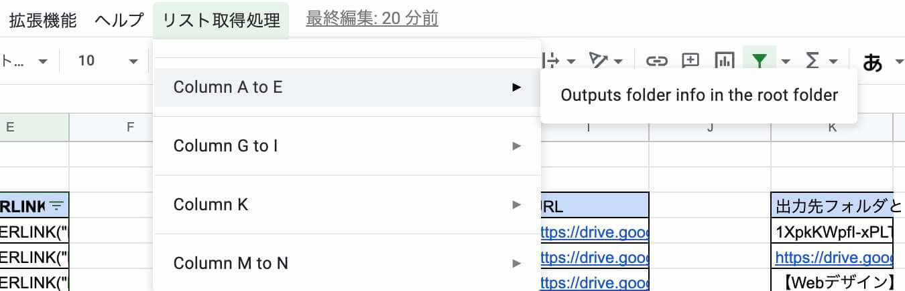

# FolderListGetter

# Table of Contents

- [FolderListGetter](#folderlistgetter)
- [Table of Contents](#table-of-contents)
- [What are Functions](#what-are-functions)
  - [`getFolderListInFolder`](#getfolderlistinfolder)
  - [`getFileListInFolder`](#getfilelistinfolder)
  - [`copyFileToTargetFolder`](#copyfiletotargetfolder)
  - [`renameFiles`](#renamefiles)
- [Operation](#operation)

# What are Functions

`FolderListGetter` has multi functions.

- getFolderListInFolder
- getFileListInFolder
- copyFileToTargetFolder
- renameFiles

## `getFolderListInFolder`

Gets following information of folders in Root folder.

- Name
- ID
- URL
- Size

## `getFileListInFolder`

Gets following information of files in the folder whose ID is `B1` cell's value.

- Name
- ID
- URL

## `copyFileToTargetFolder`

Copies file to the folder whose ID is `K4` cell's value.

Can set following property of copied files.

- Prefix
- Number of files

## `renameFiles`

Renames files whose ID is `N` column's values.

Must set new file name in `M` column.

# Operation

You can execute above-mentioned functions at custom menu after you finish those settings.

